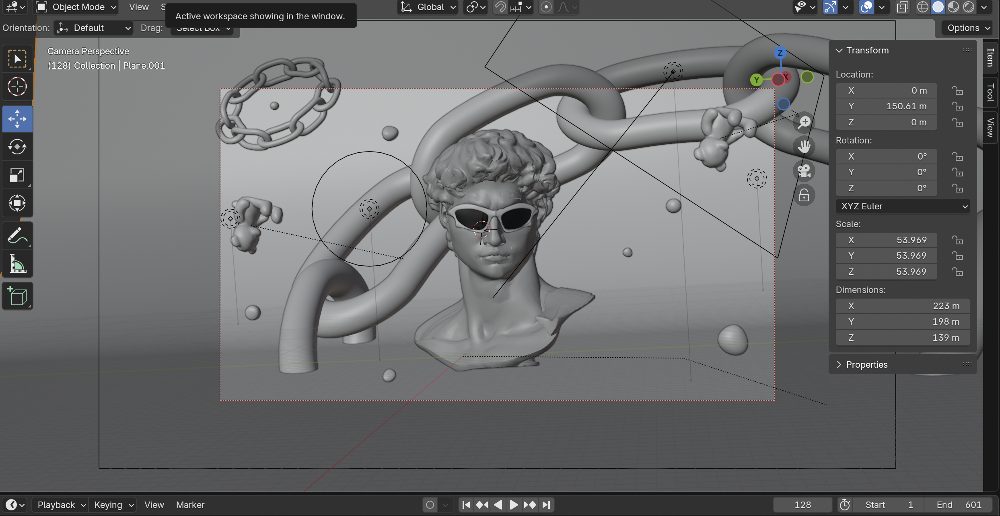

# The REM Project  

**The REM Project** is an atmospheric narrative prototype built with Three.js, exploring the blurry edges between memory, dream, and distorted perception.  
You enter a fragmented world shaped by childhood echoes and the shadow of a forgotten sleep study called **SOMNA**.

> _This project was created as part of a university course. It's not a finished game – but a solid foundation for a larger, interactive experience._

## ✨ What to Expect

In its current state, the game includes:

-  A **clickable menu**
-  A **fully playable first room** with interactive puzzles, sound & narration 
-  **Two custom-cutscenes** that hint at the story’s deeper layers
-  A **second room** featuring further interactions and a memory-based quiz

You’ll interact with objects, uncover strange fragments, and be guided by a cryptic, sometimes sassy narrator — all while trying to piece together who you were… and what happened.

## Story Overview

> After weeks of insomnia,  
> you signed up for a study.  
> They said it was a therapy.  
> Something experimental — but promising.  
>  
> They said you’d finally sleep.  
>  
> But now you're somewhere else.  
> Between memory and dream.  
> Everything feels real — and wrong.  
>  
> A turquoise glow follows you.  
> A voice keeps whispering.  
> Fragments return. Others fade.  
>  
> **Find your way back.**  
> Or deeper in.  
> Before you forget who you were.

## 🪼 The REM Substance

At the core of the SOMNA experiment lies a rare, forbidden substance — a psychoactive extract derived from mysterious, deep-sea jellyfish.  
Known only to select researchers and shadowy organizations, this **turquoise glowing extract** was designed to intensify REM sleep and open doors to hidden layers of consciousness.

The REM Substance is your connection to this dream logic reality — and your only clue to escaping it.

## Tools Used

-  **Three.js** — real-time 3D rendering  
-  **Blender** — 3D modeling & animation  
-  **Adobe After Effects / Premiere Pro** — cutscene post-production  
-  **Illustrator / Photoshop / Procreate** — visual design & textures  
-  **Eleven Labs** — AI voice generation  
-  **VS Code & GitHub Projects** — development & project management  

---

## Team SOMNA

- 🎮 **Shisir** – Head Developer  
- 🎨 **Amelie** – Creative Direction, Cutscenes, Design  
- 🧩 **Miriam** – Scrum Master, Developer  
- 🧭 **Samira** – Developer

---

##  Documentation

### Screen Video Room 1  
  
*A walkthrough of an early stage of Room 1.*

---

## 🧪 Design Research & Ideation  
[🔗 FigJam Board – Concept & Planning](https://www.figma.com/board/Tt5eXHgnUpSVIPkEpgLyF2/3D-Game?node-id=0-1&t=mEG6sSPjzyisHiGq-1)

---

## 💤 To Be Continued…

> You’ve only just entered the REM state.  
> The surface is cracked — but the depths remain.  
>  
> For now:  
> **Wake up... or keep dreaming.**
